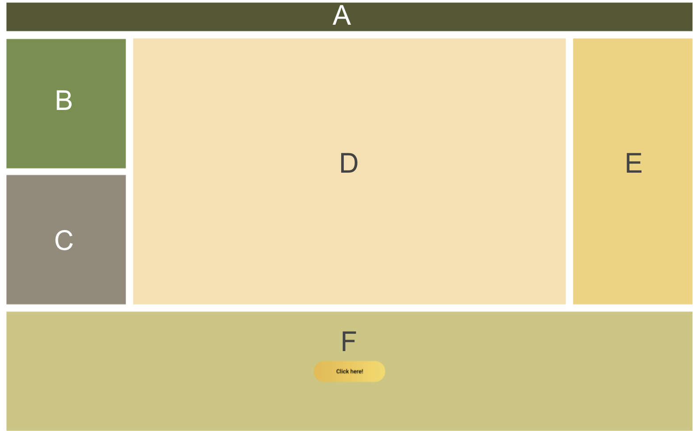
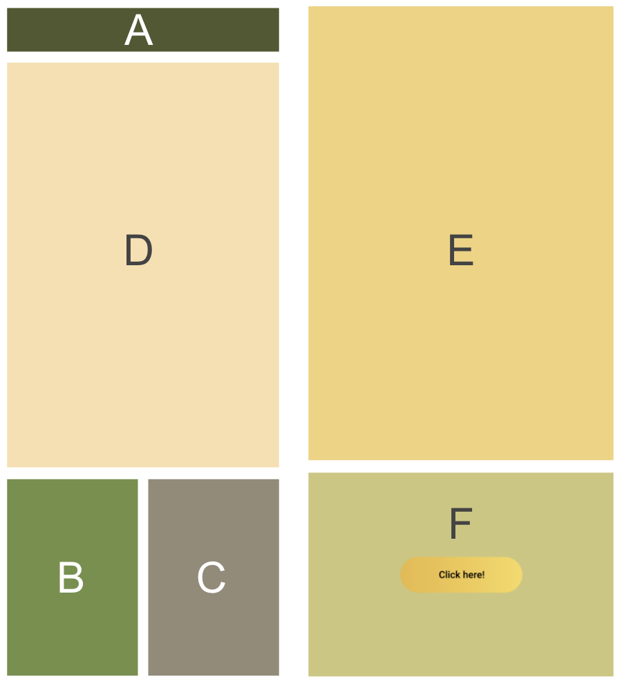

This project was bootstrapped with [Create React App](https://github.com/facebook/create-react-app).

## To start the project

Clone the project
`git clone git@github.com:AudyOdi/hometask.git`

Install all dependencies. I use Yarn for this.
`yarn`

Run the app
`yarn start`

Open [http://localhost:3000](http://localhost:3000) to view it in the browser.

# About the layout

The app layout consists of boxes that I divided as this pictures below
Big Screen Layout

Small Screen Layout

The app will change the layout automatically depends on the screen size, shown in demo below

